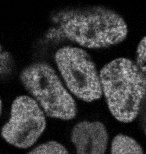

<!-- start abstract -->
# Cohesin_Residence_Time

This is a repository to analyse inversed fluorescence recovery after photobleaching (iFRAP) data in order to estimate the residence time of cohesin on DNA.

## Repository Overview
* `docs`: Contains all project documentation.
* `infrastructure`: Contains detailed installation instructions for all requried tools.
* `ipa`: Contains all image-processing-and-analysis (ipa) scripts which are used for this project to generate final results.
* `runs`: Contains all config files which were used as inputs to the scripts in `ipa`.
* `scratchpad`: Contains everything that is nice to keep track of, but which is not used for any final results.

## Setup
Detailed install instructions can be found in [infrastructure/README.md](infrastructure/README.md).

## Example

An example on how to use this repository can be found in the [examples](docs/source/example.md).

<!-- ## Citation
Do not forget to cite our [publication]() if you use any of our provided materials. -->

---
This project was generated with the [faim-ipa-project](https://fmi-faim.github.io/ipa-project-template/) copier template.

<!-- end abstract -->
